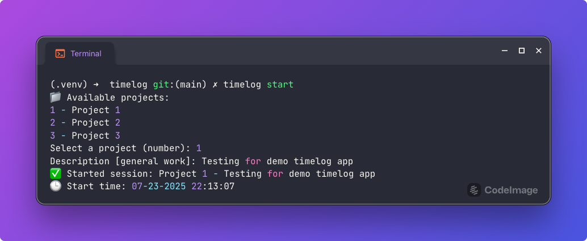
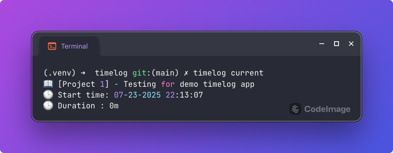
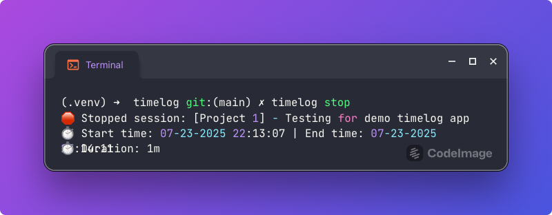
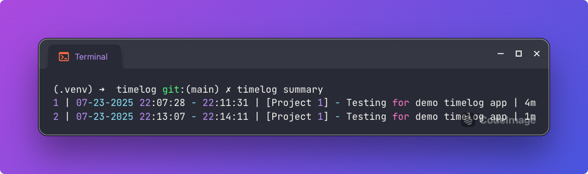

# Timelog App

## Overview
Timelog is a command-line application designed to help users track the time they spend on various tasks. It provides a simple interface to start and stop time entries, as well as to view summaries of logged time.

## Use Cases
- Problem: You need to track how much time you spend on different tasks.
- Solution: Use the timelog app to start and stop time entries, and view summaries of your logged time with simple commands.

## Demo
### Start a new time entry


### Current time entry


### Stop the current time entry


### View all time entries for today


## Features
- Start a new time entry
- Stop the current time entry
- View the current time entry
- View all time entries for today
- [Incoming] Export time entries to a CSV file command
- [Incoming] Automation export the summary of time entries to a CSV file at the end of the day

## Installation
1. Clone the repository and redirect to the project directory
   ```
    git clone https://github.com/tinpham5614/timelog.git
    cd timelog
   ```
2. Create a virtual environment
   - For macOS/Linux:
    ```
    python -m venv .venv
    source .venv/bin/activate # macOS/Linux
    ```
   - For Windows:
    ```
    python -m venv .venv
    .venv\Scripts\activate
    ```
3. Install dependencies (editable mode)
    ```
    pip install -e .
    ```

    Wait for the installation to complete. This will set up the timelog app and its dependencies.
    Congratulations! You have successfully set up the timelog app.

## Usage
- Start a new time entry: `timelog start`
- Stop the current time entry: `timelog stop`
- View the current time entry: `timelog current`
- View all time entries for today: `timelog summary`

## Contributing
Contributions are welcome! Please submit a pull request or open an issue for any bugs or feature requests.

## License
This project is licensed under the MIT License - see the [LICENSE](LICENSE) file for details